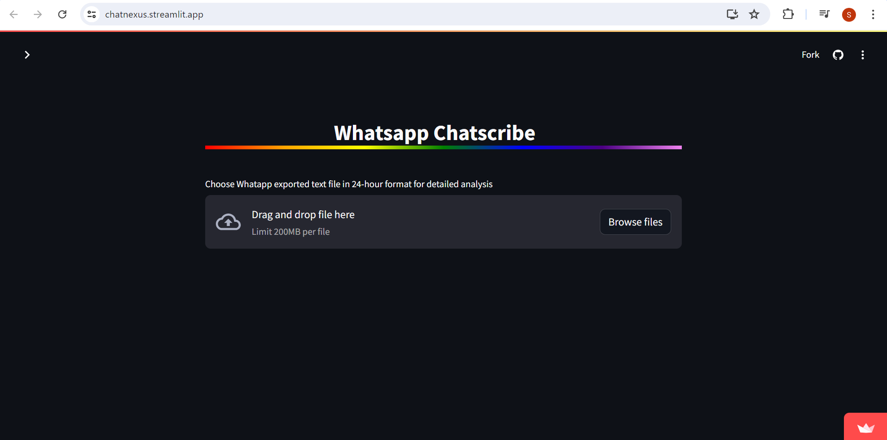

<h1 align="center">Chat Analyser</h1>
<h5 align="center">"An simple  web application that can analyse and provide useful information about whatapp chats"</h5>

<hr>


# Project Overview

This Project uses various libraries of python to analyze chat input given in 24 hr format. 


# Web Application

This streamlit based application allows users to check the contents of information in details and provide greater insight as and when needed


<!---->

## Project Contributors

[@Sayantan Sen](https://github.com/Sayantan-Sen-2003)
 

## Documentation

[Python](https://docs.python.org/3/)

[Streamlit](https://docs.streamlit.io/)


## Python libraries  used

matplotlib, 
pandas, 
seaborn, 
streamlit, 
wordcloud, 
urlextract, 
emoji


## TECHNOLOGY STACK


## Install the libraries in the local environment

```bash
  pip install -r requirements.txt
  ```


## Run Command

To run this project 

```bash
  streamlit run app.py
```
in root directory

## Website Preview
 



 

## Live 

Check it out on Streamlit --> https://chatnexus.streamlit.app/

Check it out on Render --> https://chat-analyser-g0pl.onrender.com

